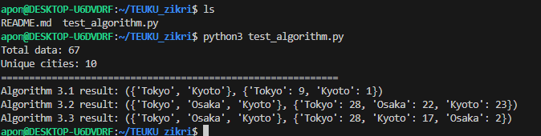

# Algorithm 3.1 3.2 3.3 implementation

**date:** 10 october 2025

slides:
https://spatiotemporaldata2025.github.io/TEUKU_zikri/Algo1

## Overview

we implemented and compared three algorithms (3.1, 3.2, and 3.3) as part of our class assignment.
each algorithm focuses on identifying and maintaining the most frequently appearing elements in a dataset.

## Implementation and result

the test implementation of these algorithms was written in python and located in the file `algo1.ipynb`.

data example:

`
[
    "Tokyo", "Kyoto", "Osaka", "Tokyo", "Nagoya", "Osaka", "Tokyo",
    "Kyoto", "Shizuoka", "Kyoto", "Osaka", "Tokyo", "Kobe", "Tokyo",
    "Kyoto", "Tokyo", "Hiroshima", "Osaka", "Tokyo", "Kyoto", "Sendai",
    "Tokyo", "Tokyo", "Osaka", "Kyoto", "Nagoya", "Tokyo", "Kyoto",
    "Tokyo", "Osaka", "Tokyo", "Kyoto", "Tokyo", "Tokyo", "Osaka",
    "Kyoto", "Tokyo", "Nagoya", "Tokyo", "Kyoto", "Osaka", "Tokyo",
    "Fukuoka", "Tokyo", "Kyoto", "Tokyo", "Sapporo", "Kyoto", "Osaka",
    "Tokyo", "Kyoto", "Tokyo", "Osaka", "Kyoto", "Tokyo", "Nagoya",
    "Tokyo", "Kyoto", "Osaka", "Tokyo", "Tokyo", "Kyoto", "Tokyo",
    "Tokyo", "Osaka", "Tokyo", "Kyoto"
]`

the execution result can be seen below.

