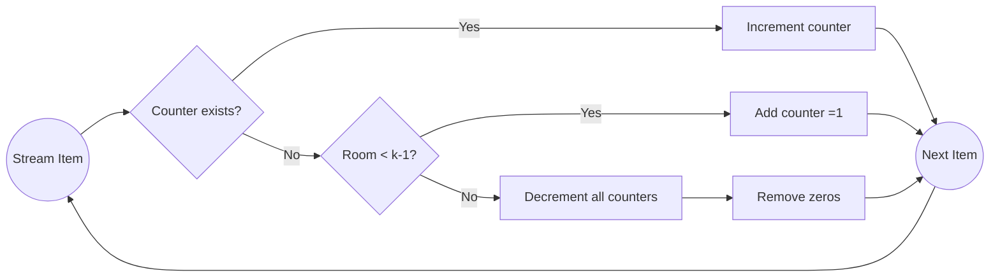

# Misra–Gries Algorithm 実装発表

<div class="mt-10">
  <p class="text-2xl mb-6">チームB</p>
  <p class="text-xl">Teuku Zikri Fatahillah · Rawich Piboonsin · 河野拓斗</p>
  <p class="text-md opacity-70 mt-4">Goal: Find elements with frequency > n/k using only O(k) memory.</p>
</div>

<div @click="$slidev.nav.next" class="mt-12 py-1 cursor-pointer" hover="bg-white op-10">
  Press Space to start <carbon:arrow-right />
</div>

---
layout: two-cols
---

# Outline

1. Problem Definition
2. Use Cases & Motivation
3. Core Idea
4. Algorithm Steps
5. Example Walkthrough
6. Correctness & Guarantees
7. Complexity & Space
8. Comparison (Boyer–Moore, Count-Min Sketch)
9. Implementation Notes
10. Edge Cases & Pitfalls
11. Extensions
12. Demo & Code
13. References

::right::
<Toc minDepth="1" maxDepth="2" />

---

# Problem Definition

Given a stream of n items (can’t store all), and a threshold parameter k (>1), report all items whose true frequency f(x) > n/k.

Requirements:

- Single pass over data (streaming)  
- Sublinear memory (O(k))  
- Return candidate set superset of real heavy hitters  
- Provide upper & lower bounds on counts after verification pass (optional)

Terminology: “Heavy hitter” / “frequent element” / “majority (for k=2)”

---

# Motivation / Use Cases

- Network traffic monitoring (top source IPs)
- Log analytics (frequent error codes)
- Sensor streams (dominant events)
- E-commerce (popular products in clickstream)
- Security anomaly detection (suspicious repeated access)

Why not exact counting? Too much memory for large domain. Misra–Gries trades a tiny approximation for drastic memory savings.

---

# Core Idea (Intuition)

Maintain at most (k-1) counters. When a new item arrives:

1. If its counter exists, increment.
2. Else if less than k-1 counters, allocate one (count=1).
3. Else decrement all counters by 1 and delete those that hit 0.

Rationale: A true heavy hitter occurs so often it survives global decrements.

---

# Algorithm (Pseudo-code)

```python {lines:true}
def misra_gries(stream, k):
    counters = {}  # value -> count
    for x in stream:
        if x in counters:
            counters[x] += 1
        elif len(counters) < k - 1:
            counters[x] = 1
        else:
            # decrement all
            remove = []
            for v in counters:
                counters[v] -= 1
                if counters[v] == 0:
                    remove.append(v)
            for v in remove:
                del counters[v]
    # Optional second pass to get exact counts for candidates
    return counters
```

Guarantee: Any element with frequency > n/k will appear in counters at end.

---

# Example Walkthrough

Stream:  [A, B, C, A, B, A, D, A, B, A, B, B]  (n = 12, k = 4 ⇒ threshold n/k = 3)

| Step | Item | Action | Counters |
|------|------|--------|----------|
| 1 | A | add | A:1 |
| 2 | B | add | A:1 B:1 |
| 3 | C | add | A:1 B:1 C:1 |
| 4 | A | inc | A:2 B:1 C:1 |
| 5 | B | inc | A:2 B:2 C:1 |
| 6 | A | inc | A:3 B:2 C:1 |
| 7 | D | full → decrement all | A:2 B:1 C:0 → remove C | A:2 B:1 |
| 8 | A | inc | A:3 B:1 |
| 9 | B | inc | A:3 B:2 |
|10 | A | inc | A:4 B:2 |
|11 | B | inc | A:4 B:3 |
|12 | B | inc | A:4 B:4 |

True frequencies: A=5, B=6, C=1, D=1. Heavy hitters (n/k=3): A,B preserved.

---

# Correctness & Error Bounds

Let f(x) be true frequency, c(x) final counter.

Properties:

- If f(x) > n/k ⇒ x in counters.
- For any candidate x: f(x) ≥ c(x).
- For any item x (candidate or not): f(x) - c(x) ≤ n/(k-1).

Thus we may have false positives, but never miss true heavy hitters.

Sketch: Each decrement phase conceptually removes k distinct items; a real heavy hitter cannot be removed enough times to vanish.

---

# Complexity

- Time: O(n * k) naive due to decrement loop of size ≤ k-1 each time.  
  Optimization: store counters in array / dictionary; cost amortized ⇒ O(nk) worst-case, typically near O(n).
- Space: O(k)
- Passes: 1 (+ optional 2nd pass to get exact counts for remaining candidates)

Comparison memory (domain size d):

| Method | Memory | Guarantee |
|--------|--------|-----------|
| Exact Hash | O(d) | Exact |
| Misra–Gries | O(k) | No false negatives |
| Count-Min Sketch | O(k log 1/δ) | Probabilistic bounds |

---

# Comparison with Others

| Algorithm | Purpose | Memory | Error Type |
|-----------|--------|--------|-----------|
| Boyer–Moore | Majority (> n/2) | O(1) | Only majority | 
| Misra–Gries | All > n/k | O(k) | False positives | 
| Count-Min Sketch | Frequency approx | O(1/ε log 1/δ) | Overestimates | 
| Space-Saving | Top-K frequent | O(k) | Approx counts |

Misra–Gries generalizes Boyer–Moore (k=2).

---

# Implementation Notes

- Use dictionary (value → count) for generic data types.
- For high-volume numeric IDs, arrays with indirection can reduce overhead.
- Decrement loop cost: For large k, consider batching or alternative algorithms (Space-Saving) for speed.
- After first pass, run second pass counting only candidates for exact frequencies.
- Parallel streams: merge by summing counters then re-running reduction phase.

---

# Edge Cases & Pitfalls

- k ≤ 1: invalid (threshold ≥ n) → no heavy hitters conceptually.
- All distinct elements: counters churn; final candidates ≤ k-1 but none exceed threshold.
- Extremely skewed: one element dominates; algorithm behaves like majority vote.
- Non-hashable objects: need custom key extraction.
- Data with deletions: Misra–Gries assumes append-only streams; handle deletions via differential logs.

---

# Extensions

- Track approximate counts for all items using combination with Count-Min Sketch (hybrid).
- Sliding windows: use exponential histograms / bucketization.
- Distributed streaming: run locally then merge counters; verify with second pass on sampled union.
- Weighted items: decrement by weight; requires careful normalization.

---

# Demo (Python)

```python {monaco-run}
from collections import Counter

def misra_gries(stream, k):
    counters = {}
    for x in stream:
        if x in counters:
            counters[x] += 1
        elif len(counters) < k - 1:
            counters[x] = 1
        else:
            remove = []
            for v in list(counters.keys()):
                counters[v] -= 1
                if counters[v] == 0:
                    remove.append(v)
            for v in remove:
                del counters[v]
    return counters

data = list("ABCA B A D A B A B B".replace(" ",""))
k = 4
approx = misra_gries(data, k)
true = Counter(data)
print("Candidates:", approx)
print("True counts:", true)
print("Heavy hitters (threshold n/k):", [x for x,c in true.items() if c > len(data)/k])
```

---

# Visualization (Mermaid)



---

# Mathematical Bound (LaTeX)

For any item x:

$$ f(x) - c(x) \le \frac{n}{k-1} $$

If \( f(x) > \frac{n}{k} \Rightarrow x \) survives all decrements.

---

# References

- Misra, Jayadev; Gries, David (1982). "Finding repeated elements". 
- Manku & Motwani (Approximate Frequency Counts over Data Streams).
- Cormode & Muthukrishnan (Count-Min Sketch).
- Boyer & Moore (Majority Vote Algorithm).

---
layout: center
class: text-center
---

# Q & A

Thanks! Questions?

<div class="mt-8 text-sm opacity-60">Misra–Gries: Precise heavy hitters with tiny memory.</div>

---
layout: center
class: text-center
---

# Backup Slide: Second Pass Code

```python
from collections import Counter
true_counts = Counter(data)
verified = {x:true_counts[x] for x in approx}
```

<PoweredBySlidev mt-10 />
