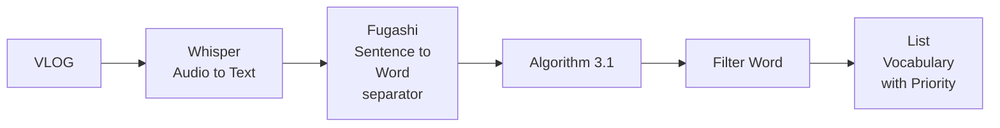

<style>
:root {
  --slidev-theme-primary: #e91e63;
  --slidev-theme-accents-pink: #f48fb1;
  --slidev-theme-accents-purple: #ba68c8;
  --slidev-theme-accents-blue: #90caf9;
}

.slidev-layout {
  background: linear-gradient(135deg, #e3f2fd 0%, #f3e5f5 50%, #fce4ec 100%);
}

h1, h2, h3 {
  background: linear-gradient(135deg, #667eea 0%, #e91e63 50%, #f093fb 100%);
  -webkit-background-clip: text;
  -webkit-text-fill-color: transparent;
  background-clip: text;
}

.slidev-code {
  background: rgba(255, 255, 255, 0.9) !important;
  border: 2px solid #f48fb1;
  border-radius: 8px;
}
</style>

## Implementation of
## Misra–Gries Algorithm
## on Language Learning Process

<div class="mt-8">
  <p class="text-xl">Teuku Zikri Fatahillah</p>
</div>

<div @click="$slidev.nav.next" class="mt-12 py-1 cursor-pointer" hover="bg-white op-10">
  Press Space to start <carbon:arrow-right />
</div>


---

# Introduction:

Team B has many international members. It's like 40% of our group.

The biggest issue we face is language barriers.

Maybe we can use knowledge we got in this course to solve our problem.

---

# Problem when learning new Language:

• Memorizing new vocabulary is time-consuming and involves a large volume of words

• It is more efficient to start with the vocabulary that appears most frequently (in real-world context).

---

# The Idea

We apply course techniques (Algorithm 3.1) to extract frequently used vocabulary from real-world videos, helping learners prioritize what to memorize

---

# How to do it?



---

# Whisper output:

1. 00:00:00,000 --> 00:00:03,800  
   みなさんこんにちは、あかねです。
2. 00:00:03,800 --> 00:00:07,320  
   これは1月に撮影した動画です。
3. 00:00:07,320 --> 00:00:10,520  
   私は今3つの仕事をしています。
4. 00:00:10,520 --> 00:00:16,880  
   そのうちの1つは東京にある日本語学校で日本語を教える仕事です。
5. 00:00:16,880 --> 00:00:24,680  
   今日の動画は仕事が終わった後、2年ぶりに友達に会って一緒に遊んだ日のVlogです。

---

# Tokenization

<style scoped>
.slidev-code { font-size: 0.45em !important; line-height: 1.3 !important; }
h1 { margin-bottom: 0.5rem !important; }
</style>

```python {lines:true}
def tokenize_with_fugashi(text):
    tagger = Tagger()
    tokens = []
    pos_list = []
    for tok in tagger(text):
        # try to get a lemma/base form safely; many dicts expose 'lemma' or 原形
        base = None
        try:
            feat = tok.feature
            if isinstance(feat, dict):
                base = feat.get("lemma") or feat.get("原形") or feat.get("基本形")
            elif isinstance(feat, (list, tuple)) and len(feat) > 7:
                # some dictionaries put base form at index 7
                base = feat[7] or None
        except Exception:
            base = None
        token_text = base or getattr(tok, "normalized", None) or tok.surface
        # determine coarse POS string if available
        pos = None
        try:
            if hasattr(tok, "pos"):
                pos = tok.pos
            else:
                feat = tok.feature
                if isinstance(feat, dict):
                    pos = feat.get("pos") or feat.get("品詞")
                elif isinstance(feat, (list, tuple)) and len(feat) > 0:
                    pos = feat[0]
        except Exception:
            pos = None
        tokens.append(token_text)
        pos_list.append(pos or "")
    return tokens, pos_list
```

---

# Algorithm (Misra-Gries)

```python {lines:true}
def misra_gries(stream, k):
    if k <= 1:
        raise ValueError("k must be > 1")
    counters = {}
    for x in stream:
        if x in counters:
            counters[x] += 1
        elif len(counters) < k - 1:
            counters[x] = 1
        else:
            # decrement all
            remove_keys = []
            for y in list(counters.keys()):
                counters[y] -= 1
                if counters[y] == 0:
                    remove_keys.append(y)
            for y in remove_keys:
                del counters[y]
    return counters
```

Guarantee: Any element with frequency > n/k will appear in counters at end.

---

# Result

After applying the Misra-Gries algorithm to the video transcript, we get a prioritized list of frequently used vocabulary words. This helps language learners focus on the most common words first.

<div class="flex justify-center items-center h-80">
  
</div>

---

# What's Next?

• After learning, user marks words as "mastered" (added to filters.txt file).

• Future runs skip those tokens, focusing on remaining vocabulary.

• This creates a personalized, evolving curriculum derived from real-world content.

---
layout: center
class: text-center
---

# Q & A

Thanks! Questions?

<div class="mt-8 text-sm opacity-60">Misra–Gries: Precise heavy hitters with tiny memory.</div>

---
layout: center
class: text-center
---

# Thank You!

<div class="mt-12">
  <p class="text-4xl mb-8">ありがとうございました</p>
</div>

<div class="mt-16 text-sm opacity-60">
  Misra–Gries Algorithm Implementation for Language Learning
</div>