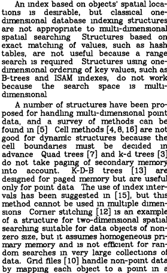
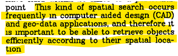
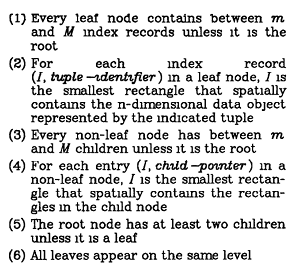

# Report

**R-tree: A Dynamic Index Structure for Spatial Searching**
by Antonin Guttman and Michael Stonebraker

## Introduction

When this R-tree paper was written, I did not fully understand the research context at that time, but it seems there were already several existing search algorithms such as B-trees.

To start, I tried to understand the content of the paper itself.

In the introduction, the author mentioned several earlier indexing methods and their limitations:

<!-- 
"indexing structures are not appropriate to spatial searching. 
Multi-dimensional structures based on exact matching of values, 
such as hash tables, are not useful because a range search is required. 
Structures using one-dimensional ordering of key values, 
such as B-trees and ISAM indexes, do not work because the search is multi-dimensional."
-->

In the early 1980s, database systems such as **INGRES** and **System R** only supported classical indexing methods:

* **B-tree / ISAM** → suitable for one-dimensional ordered data
* **Hash table** → suitable for exact match searches

However, there was no efficient method for:

* Multi-dimensional data (2D, 3D, etc.)
* Objects with actual size (not just points, but areas such as rectangles or polygons)
* Searches based on position or area (range / spatial search)

As a result, when handling spatial data such as maps, chip layouts, or CAD designs, finding “all objects within 20 km of a given point” required checking every record linearly.
This was very slow for large datasets containing millions of objects.

In other words, the authors wanted a database system capable of answering spatial queries such as:

* Which objects are inside this region?
* Which objects are near point (x, y)?
* Which parts of the map overlap with a given area?

Without scanning the entire table.

---

## Application Context

The paper also mentioned several major application areas for spatial indexing.

* **Computer-Aided Design (CAD):** finding circuit parts in a specific layout area.
* **Geographic Information Systems (GIS):** locating map regions within a certain radius.
* **General spatial databases:** storing building footprints, rivers, zones, and other region-based data.

---

## Concept of R-Tree

The **R-Tree** organizes spatial data into a **hierarchy of bounding rectangles**.

* Each node represents a region that covers several child objects.
* **Leaf nodes** store the actual spatial objects.
* **Non-leaf nodes** store bounding boxes that enclose all their children.
* All leaf nodes exist at the same level, keeping the tree balanced like a B-tree.

With this structure, searches do not need to scan all data; only the branches whose bounding boxes overlap with the query region are explored.

Efficiency is achieved because the search process only visits nodes whose bounding boxes intersect with the query area.
Nodes that do not intersect are ignored without being accessed.

---

## Comparison with Previous Methods

| **Method**           | **Advantage**                                                           | **Disadvantage**                                                                  |
| -------------------- | ----------------------------------------------------------------------- | --------------------------------------------------------------------------------- |
| **Hash Table**       | Very fast for exact-match lookups                                       | Cannot perform range or spatial queries                                           |
| **B-tree / ISAM**    | Efficient for one-dimensional ordered data                              | Cannot handle multi-dimensional data; no concept of spatial proximity             |
| **R-Tree**           | Dynamic, balanced hierarchy of bounding boxes; efficient spatial search | More complex to implement and maintain than traditional B-trees                   |

---

## Conclusion

The **R-Tree** successfully addressed the shortcomings of earlier indexing structures by combining the hierarchical efficiency of B-trees with true multi-dimensional spatial capability.
It provides a **dynamic and efficient index structure** for spatial and range-based searches.

Key findings from the paper include:

1. The **linear R-tree algorithm** performs almost as well as more complex and computationally expensive methods. Slightly less optimal splits do not significantly affect query performance.
2. The **R-tree** proved to be a highly useful structure for managing spatial data, especially in secondary storage (disk). It was later adopted by the **IBM Informix system** as an efficient spatial indexing method.
3. Beyond spatial databases, **R-trees** can also be applied to other types of multi-dimensional data, such as numerical value combinations or temporal data (time intervals).

In summary, the R-tree plays a key role in improving **search efficiency for spatial data** by:

* Reducing the number of nodes accessed using bounding-box overlap pruning
* Maintaining a balanced tree structure for logarithmic search time
* Supporting dynamic insertion and deletion of multi-dimensional data

This structure has become the foundation of modern spatial database systems, GIS engines, and any applications requiring fast search over multi-dimensional or geometric data.
