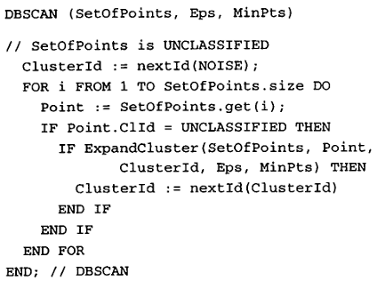
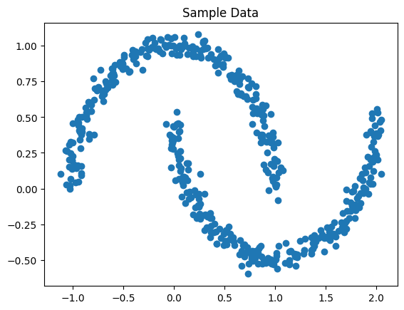
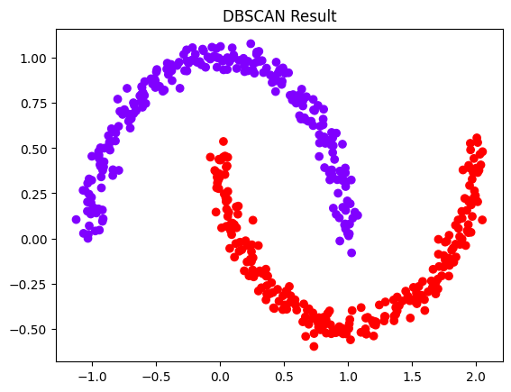

# Report on DBSCAN and Its Subsequent Developments

## 1. Original DBSCAN (Ester et al., KDD 1996)

### Citation
Ester, M., Kriegel, H.-P., Sander, J., & Xu, X.
"A Density-Based Algorithm for Discovering Clusters in Large Spatial Databases with Noise."
Proceedings of the 2nd International Conference on Knowledge Discovery and Data Mining (KDD), 1996, pp. 226–231.

### 1.1 Motivation

Classical clustering algorithms (k-means, k-medoids, hierarchical) show serious limitations for large spatial databases: they require the number of clusters k in advance, are biased toward convex cluster shapes, and often do not scale well to large datasets.

DBSCAN (Density-Based Spatial Clustering of Applications with Noise) was proposed to meet three requirements:

Minimal domain knowledge (no need to know k).

Arbitrary cluster shapes (not restricted to convex/spherical).

Good efficiency on large spatial databases.

### 1.2 Intuitive Idea

Human observers can easily pick out clusters in scatter plots because cluster regions have higher point density than surrounding noise. DBSCAN formalizes this by defining clusters as connected dense regions separated by areas of low density.

Key intuition:

Inside a cluster: many neighbors close to each point.

Outside: density drops below a threshold → considered noise.

### 1.3 Formal Definitions

Let 
𝐷
D be a set of points in a metric space with distance function dist(·,·).

#### 1.3.1 Eps-neighborhood

For point 
𝑝
p, its Eps-neighborhood is

𝑁
𝐸
𝑝
𝑠
(
𝑝
)
=
{
𝑞
∈
𝐷
∣
𝑑
𝑖
𝑠
𝑡
(
𝑝
,
𝑞
)
≤
𝐸
𝑝
𝑠
}
.
N
Eps
	​

(p)={q∈D∣dist(p,q)≤Eps}.

(Definition 1).

Two global parameters:

Eps: search radius

MinPts: minimum number of points required to form a dense region

#### 1.3.2 Core, Border, and Noise Points

Core point: 
∣
𝑁
𝐸
𝑝
𝑠
(
𝑝
)
∣
≥
𝑀
𝑖
𝑛
𝑃
𝑡
𝑠
∣N
Eps
	​

(p)∣≥MinPts.

Border point: not core, but lies in the Eps-neighborhood of some core point.

Noise point: neither core nor border.

Figure 2 in the paper visually distinguishes core and border points.

#### 1.3.3 Density Reachability and Connectivity

Directly density-reachable:

𝑝
p is directly density-reachable from 
𝑞
q if 
𝑝
∈
𝑁
𝐸
𝑝
𝑠
(
𝑞
)
p∈N
Eps
	​

(q) and 
𝑞
q is a core point (i.e., 
∣
𝑁
𝐸
𝑝
𝑠
(
𝑞
)
∣
≥
𝑀
𝑖
𝑛
𝑃
𝑡
𝑠
∣N
Eps
	​

(q)∣≥MinPts).

Density-reachable:

𝑝
p is density-reachable from 
𝑞
q if there exists a chain 
𝑞
=
𝑝
1
,
𝑝
2
,
…
,
𝑝
𝑛
=
𝑝
q=p
1
	​

,p
2
	​

,…,p
n
	​

=p where each 
𝑝
𝑖
+
1
p
i+1
	​

 is directly density-reachable from 
𝑝
𝑖
p
i
	​

.

Density-connected:

𝑝
p and 
𝑞
q are density-connected if there exists some point 
𝑜
o such that both 
𝑝
p and 
𝑞
q are density-reachable from 
𝑜
o.

Using these concepts, a cluster is defined as a maximal set of density-connected points (Definition 5), and noise as all points not belonging to any cluster (Definition 6).

### 1.4 Algorithm Description

High-level procedure (Section 4):

Mark all points as UNCLASSIFIED.

Iterate through each point 
𝑝
p:

If 
𝑝
p is UNCLASSIFIED: call ExpandCluster(D, p, Eps, MinPts).

ExpandCluster:

Compute neighborhood seeds = regionQuery(p, Eps).

If |seeds| < MinPts: mark 
𝑝
p as NOISE (not a core point).

Else:

Create new cluster ID.

Add all points in seeds to this cluster.

Repeatedly:

Take a point currentP from seeds.

Find its Eps-neighborhood result.

If |result| ≥ MinPts (currentP is core):

For every resultP in result that is UNCLASSIFIED or NOISE:

Add it to cluster.

If UNCLASSIFIED, also append to seeds.

Remove currentP from seeds.

Return success flag.

Region queries are answered efficiently using an R*-tree index, yielding average time complexity O(n log n) for n points.

### 1.5 Parameter Selection (Eps, MinPts)

DBSCAN needs only two parameters:

MinPts: typically fixed (e.g., 4 for 2D).

Eps: chosen interactively via the sorted k-distance graph: for each point, compute distance to its k-th neighbor (k = MinPts), sort these distances descending, and visually locate the first "valley" that separates noise from cluster points (Figure 4).

### 1.6 Performance Evaluation

On synthetic datasets, DBSCAN correctly finds clusters of arbitrary shapes and detects noise, while CLARANS (k-medoid based) splits large clusters and cannot model nonconvex shapes well (Figures 5 and 6).

On subsets of the SEQUOIA 2000 benchmark (up to ~12k points), DBSCAN is 250–1900× faster than CLARANS, with runtime slightly super-linear in n.

### 1.7 Conceptual Diagram of DBSCAN
              (Cluster 1)                        (Cluster 2)
          o o o o o o o o o                    x x x x x x x
        o o o ● ● ● ● o o o                x x x ● ● ● ● x x x
      o o o ● ● ● ● ● ● o o              x x ● ● ● ● ● ● ● x x
        o o o ● ● ● ● o o o                x x x ● ● ● ● x x x
          o o o o o o o o o                    x x x x x x x

Legend:
●  core points (dense region)
o  border points
·  (not shown) isolated points = noise

DBSCAN grows each cluster by connecting core points and absorbing border points reachable within Eps, while leaving isolated points as noise.

## 2. Evolution of DBSCAN: Major Subsequent Methods

Below are important algorithms that evolved directly from DBSCAN, along with their bibliographic data and how they extend or generalize the original method.

### 2.1 GDBSCAN – Generalized DBSCAN (1998)

#### Citation
Sander, J., Ester, M., Kriegel, H.-P., & Xu, X.
“Density-Based Clustering in Spatial Databases: The Algorithm GDBSCAN and Its Applications.”
Data Mining and Knowledge Discovery, 2(2), 1998, pp. 169–194. 
Springer
+1

#### 2.1.1 Main Idea

GDBSCAN generalizes DBSCAN in two key ways:

Works with point objects and spatially extended objects (e.g., polygons).

Allows arbitrary neighborhood predicates and density predicates, not restricted to Euclidean distance and point counts.
Springer
+1

Instead of hard-coded Eps and MinPts, GDBSCAN defines:

A general neighborhood predicate N(p, q) (e.g., polygon intersection, distance under custom metric).

A dense predicate on a set of objects (e.g., total area, attribute-based weight).

#### 2.1.2 Evolution from DBSCAN

GDBSCAN keeps the same high-level mechanism:

Expand clusters by exploring density-reachable objects.

Distinguish noise from cluster objects.

But it abstracts away:

Distance metric → replaced with flexible neighborhood predicate.

Simple count-based density → replaced with general density tests involving spatial and non-spatial attributes.

Conceptually:

flowchart LR
  A[DBSCAN Eps + MinPts point counts] --> B[GDBSCAN general neighborhoods general density predicates]

This evolution makes DBSCAN applicable to richer GIS data (lines, polygons) and attribute-enhanced clustering.

### 2.2 OPTICS – Ordering Points To Identify the Clustering Structure (1999)

#### Citation
Ankerst, M., Breunig, M. M., Kriegel, H.-P., & Sander, J.
“OPTICS: Ordering Points to Identify the Clustering Structure.”
Proc. ACM SIGMOD Int. Conf. on Management of Data, 1999, pp. 49–60. 
dbs.ifi.lmu.de
+1

#### 2.2.1 Main Idea

OPTICS addresses a central limitation of DBSCAN: using a single global Eps makes it difficult to handle datasets with clusters of varying density, and parameter tuning is tricky.
ResearchGate
+1

OPTICS does not output one fixed clustering. Instead, it produces:

An ordering of data points.

For each point, a reachability distance and core distance that summarize local density.
Semantic Scholar

From this reachability plot, one can:

Extract clusters at many different density levels.

Visualize the intrinsic cluster structure without choosing a single Eps.

#### 2.2.2 How OPTICS Evolves from DBSCAN

OPTICS is a soft generalization of DBSCAN:

Uses the same density-based notion (core points and neighborhoods).

Conceptual definitions of core distance and reachability distance are rooted in DBSCAN’s MinPts and Eps.
Semantic Scholar

Key changes:

Instead of running DBSCAN with one Eps, OPTICS effectively simulates DBSCAN over all Eps values up to a maximum, encoding the results in an ordered list.

This removes the requirement to find a single “correct” Eps and supports clusters that have different characteristic densities.

Diagram of relationship:

flowchart TD
  A[DBSCAN single Eps single clustering] --> B[OPTICS varied Eps reachability plot]

### 2.3 ST-DBSCAN – Spatio-Temporal DBSCAN (2007)

#### Citation
Birant, D., & Kut, A.
“ST-DBSCAN: An Algorithm for Clustering Spatial–Temporal Data.”
Data & Knowledge Engineering, 60(1), 2007, pp. 208–221. 
ScienceDirect
+2
ACM Digital Library
+2

#### 2.3.1 Main Idea

ST-DBSCAN extends DBSCAN to spatio-temporal data. It introduces three marginal extensions related to:
Bohrium
+1

How core objects are identified.

How noise is detected.

How adjacent clusters are merged.

It considers spatial proximity, temporal proximity, and non-spatial attributes, enabling discovery of clusters that are coherent in both space and time.

#### 2.3.2 Evolution from DBSCAN

Compared to DBSCAN:

Distance function becomes a composite metric over spatial and temporal dimensions (e.g., spatial Eps and temporal Eps_T).

Density predicate is adapted to ensure that points are close in space and time to be considered neighbors.

Introduces rules to merge nearby clusters whose temporal neighborhoods overlap.

Thus ST-DBSCAN keeps the same core mechanism (density-based clustering with Eps/MinPts), but generalizes the feature space and modifies the neighborhood definition to incorporate temporal constraints.

### 2.4 HDBSCAN – Hierarchical Density-Based Spatial Clustering of Applications with Noise (2013–2015, 2017 software)

#### Core References

Campello, R. J. G. B., Moulavi, D., & Sander, J.
“Density-Based Clustering Based on Hierarchical Density Estimates.”
In Advances in Knowledge Discovery and Data Mining (PAKDD), 2013. 
Springer

Campello, R. J. G. B., Moulavi, D., Zimek, A., & Sander, J.
“A Framework for Semi-supervised and Unsupervised Optimal Extraction of Clusters from Hierarchies.”
Data Mining and Knowledge Discovery, 2015. 
Springer

McInnes, L., Healy, J., & Astels, S.
“hdbscan: Hierarchical Density Based Clustering.”
Journal of Open Source Software, 2(11), 2017, Article 205. 
The Open Journal
+1

#### 2.4.1 Main Idea

HDBSCAN overcomes two major weaknesses of DBSCAN:

Sensitivity to Eps.

Inability to model clusters with strongly varying densities.

Key steps (conceptual):
Springer
+1

Build a mutual reachability graph (based on core distances, similar to OPTICS).

Compute a Minimum Spanning Tree (MST) of this graph.

Convert MST into a hierarchy of clusters by progressively increasing the density threshold.

Condense the hierarchy and use cluster stability to select a flat clustering.

HDBSCAN thus produces:

A full cluster hierarchy.

An automatic choice of a good flat clustering.

Ability to find clusters of varying densities, more robust to parameter choice than DBSCAN.

#### 2.4.2 Evolution from DBSCAN

Relationship to DBSCAN and OPTICS:
arXiv
+1

Uses the same density-based foundation (core distance, MinPts).

Like OPTICS, it explores clustering over many density levels (effectively simulating DBSCAN for a series of Eps thresholds).

Goes further by:

Constructing a mathematically well-founded hierarchy (via MST).

Introducing stability measures to objectively prefer certain clusters.

Eliminating the need for a precise Eps—only a parameter such as minimum cluster size is required.

Diagram:

flowchart TD
  A[DBSCAN] --> B[OPTICS continuous density info]
  B --> C[HDBSCAN hierarchical + stability-based cluster selection]

### 2.5 Later Variants and Ecosystem

#### 2.5.1 DBSCAN Revisited and DBSCAN*

Later work (e.g., “DBSCAN Revisited, Revisited” by Schubert et al.) clarifies theoretical aspects, parameter selection, and implementation details, and proposes DBSCAN* variants that adjust border handling while keeping the same density-based cluster semantics.
Wikipedia

#### 2.5.2 Fast and Parallel DBSCAN / DBSCAN++

Numerous algorithms focus on:

Indexing strategies (kd-trees, cover trees) to speed up region queries.

Parallel and distributed DBSCAN, mapping region queries and cluster expansion to multi-core or cluster architectures.

DBSCAN++ uses coresets and randomization to improve scalability further while approximating DBSCAN behavior.

These works maintain DBSCAN's abstract model but optimize the computational engine.

## 3. Evolution Map

Below is a simplified evolution “family tree”:

graph TD
  DB[DBSCAN (1996)]
  GDB[GDBSCAN (1998)]
  OPT[OPTICS (1999)]
  ST[ST-DBSCAN (2007)]
  HDB[HDBSCAN (2013+)]
  FAST[Fast/Parallel DBSCAN, DBSCAN++]

  DB --> GDB
  DB --> OPT
  DB --> ST
  OPT --> HDB
  DB --> FAST

GDBSCAN: generalizes neighborhoods/density.

OPTICS: replaces fixed Eps with reachability ordering.

ST-DBSCAN: extends feature space to time + space.

HDBSCAN: hierarchical, stability-based extraction.

Fast/Parallel/DBSCAN++: engineering improvements for large-scale data.

## 4. Overall Discussion

### 4.1 What DBSCAN Contributed

DBSCAN introduced a non-parametric, density-based view of clustering that:

Naturally distinguishes clusters vs. noise.

Finds arbitrarily shaped clusters.

Can be efficient on large datasets via spatial indices.

These properties made it one of the most widely used clustering algorithms in data mining and spatial analytics.

### 4.2 How Later Methods Evolved the Idea

#### Generalization of "density" and "neighborhood"

GDBSCAN and ST-DBSCAN extend the basic idea to richer object types and spatio-temporal constraints.

#### Relaxation of global Eps / single-density assumption

OPTICS and HDBSCAN address the problem of varying cluster densities by exploring density over a range of scales and building hierarchies.

#### Improved robustness and interpretability

HDBSCAN introduces stability-based selection, giving well-justified cluster choices.

Revisited formulations clarify edge cases and provide better theoretical backing.

#### Scalability

Parallel and approximate DBSCAN variants ensure that the core idea remains practical for modern large-scale datasets.

## 5. Conclusion

The original DBSCAN algorithm defined clusters as maximal sets of density-connected points and classified low-density regions as noise. This density-based viewpoint allowed it to outperform partitioning methods such as CLARANS both in accuracy and runtime on spatial databases.

Subsequent work did not replace DBSCAN but rather expanded its universe:

GDBSCAN and ST-DBSCAN generalized the notion of neighborhood and feature space.

OPTICS and HDBSCAN tackled the difficulty of choosing a single density threshold, revealing full multi-scale cluster structure.

Recent engineering variants have further improved efficiency and applicability.

Together, these developments show how a single foundational idea—clustering by density connectivity—has evolved into a rich family of algorithms for complex, large, and high-dimensional data.

---

## 6. Visual Examples

### 6.1 DBSCAN Pseudocode

The following image shows the pseudocode implementation of the DBSCAN algorithm:

### 6.2 Input Dataset

Sample input dataset used for DBSCAN clustering demonstration:

### 6.3 DBSCAN Clustering Results

The clustering results after applying DBSCAN algorithm, showing identified clusters and noise points:

