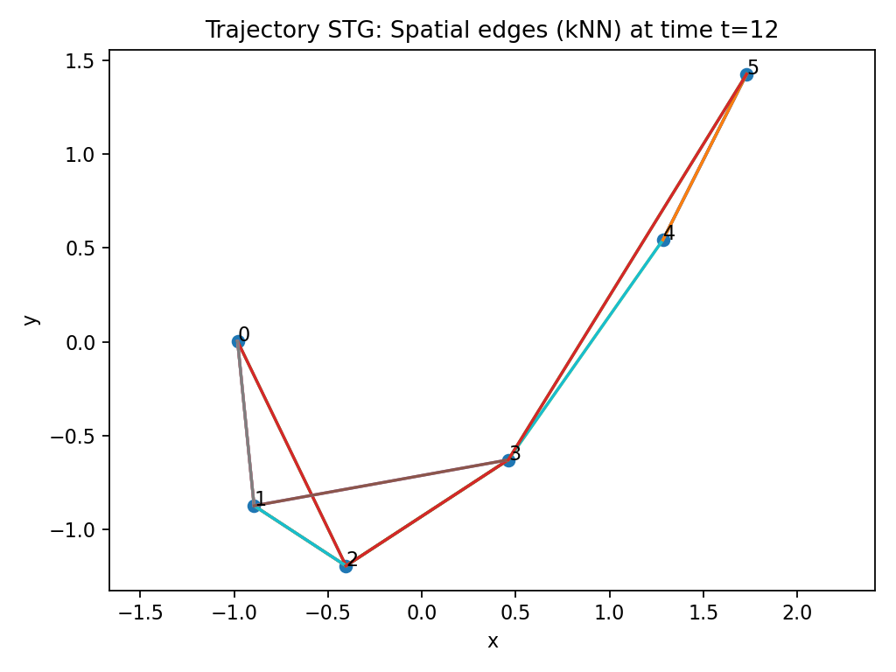
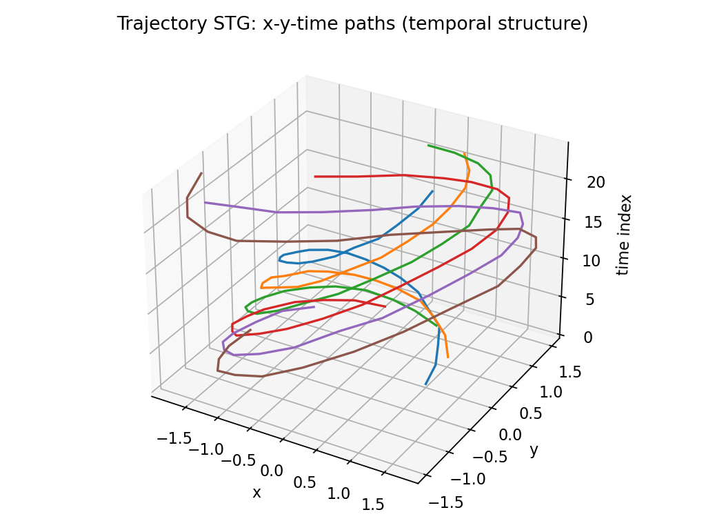
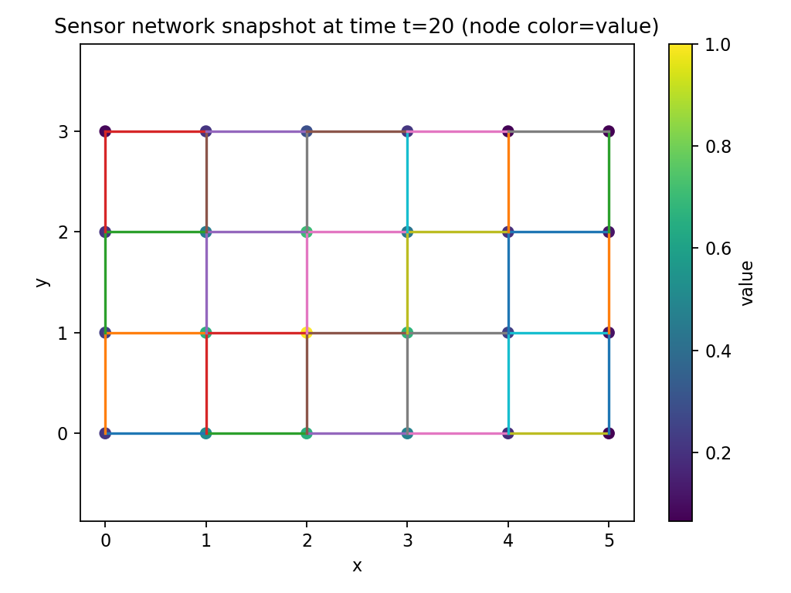
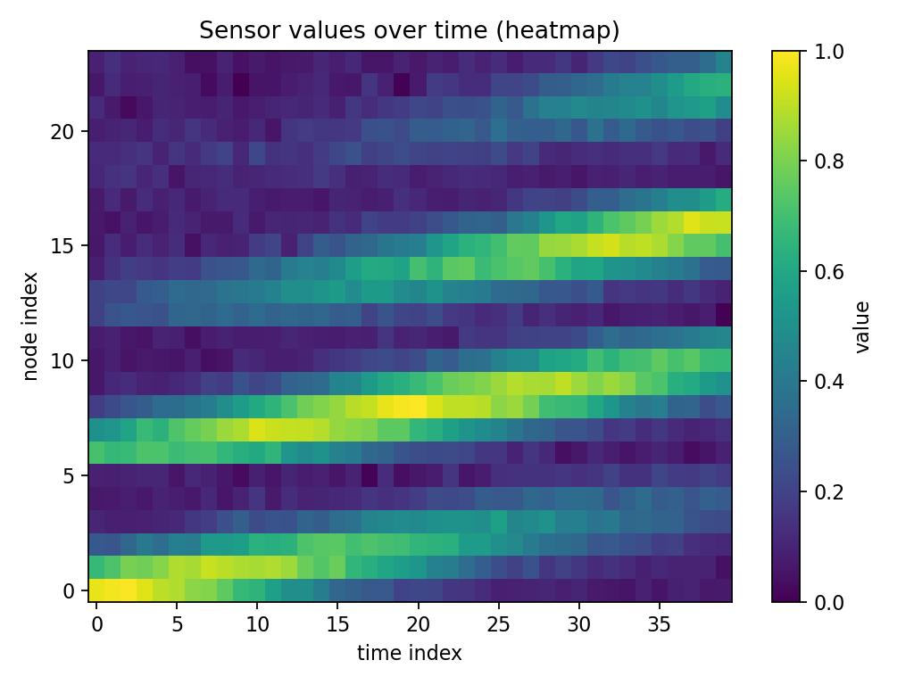

# Spatio-Temporal Graphs (STG)
Representasi ruang-waktu untuk dinamika terhubung  
teuku_zikri

---

## Agenda
- Motivasi: kapan memakai STG
- Definisi formal dan konstruksi graf
- Rezim topologi: statis vs dinamis
- Kompleksitas dan implikasi praktis
- Studi kasus sintetis (trajektori & sensor)
- Prinsip desain model dan jebakan umum

---

## Masalah yang Ditangani STG
- Dunia nyata sering punya **ketergantungan ruang + waktu** (lalu lintas, IoT, robotik kawanan).
- Model deret waktu per node gagal menangkap **propagasi** antar entitas.
- Representasi STG memaksa pesan mengalir sesuai **topologi** sambil menjaga **kontinuitas temporal**.

---

## Definisi STG (space–time expanded graph)
- Node STG = pasangan `(i, t)` artinya entitas `i` pada waktu `t`.
- Himpunan node: `V_ST = {(i,t) | i=0..N-1, t=0..T-1}`.
- Dua tipe edge:
  - **Spatial:** `(i,t) -> (j,t)` jika `j` tetangga ruang `i` pada waktu `t`.
  - **Temporal:** `(i,t) -> (i,t+1)` untuk kontinuitas.

---

## Implementasi Indeks
```text
id(i, t) = t * N + i

Temporal edges:
  id(i, t) -> id(i, t+1)   for all i, t=0..T-2

Spatial edges:
  id(i, t) -> id(j, t)     for j in N_t(i)
```
- Edge dapat diberi label (misal 0=spatial, 1=temporal) untuk operasi berbeda di GNN.

---

## Dua Rezim Tetangga Ruang
- **Topologi statis:** `N_t(i) = N(i)` tetap (jalan raya, grid sensor, pipa).
- **Topologi dinamis:** `N_t(i)` berubah (kNN berbasis posisi agen bergerak).
- Graph WaveNet menunjukkan adjacency bisa **dipelajari** untuk menutup celah data.

---

## Kompleksitas (kira-kira)
- Node: `|V_ST| = N * T`
- Temporal edges: `E_t = N * (T-1)`
- Spatial edges: `E_s_ST ≈ T * E_s` (atau `T * N * k` untuk kNN)
- Implikasi: frekuensi tinggi → graf besar; gunakan jendela waktu atau sampling.

---

## Visualisasi: Trajektori kNN (dinamis)

- Agen bergerak di 2D; tetangga ditentukan oleh kNN per waktu.
- Cocok untuk robotik kawanan atau interaksi manusia.

---

## Visualisasi: Trajektori 3D (x, y, t)

- Edges temporal menjaga kontinuitas lintasan.
- Membantu memeriksa kepadatan graf sebelum melatih model.

---

## Visualisasi: Sensor Grid (statis)

- Node = sensor; edges = tetangga grid tetap.
- Nilai node menggambarkan gelombang bergerak (analog kemacetan).

---

## Visualisasi: Evolusi Nilai Sensor

- Heatmap menunjukkan propagasi nilai sepanjang waktu.
- Berguna mendeteksi pola, anomali, atau delay.

---

## Prinsip Desain Model di Atas STG
- **Pisahkan operasi ruang vs waktu:** contoh STGCN (graph conv + temporal conv).
- **Gunakan edge type** untuk pesan heterogen (spatial vs temporal).
- **Pertimbangkan adaptasi adjacency:** belajar edge tambahan di luar graf terukur.
- **Atasi ukuran graf:** sliding window, subsampling, atau event-driven (TGN).

---

## Jebakan Umum
- kNN dinamis dapat menambah edge palsu bila jarak buruk (sensor noisy).
- Topologi statis sering **tidak lengkap** (mis-specified roads/pipa).
- Graf `N*T` dapat meledak; batching/ sampling diperlukan.
- Data tak teratur waktu → STG diskrit kurang cocok; pakai event-based.

---

## Kapan Memakai STG?
- Ada propagasi fisik/logis antar entitas.
- Hubungan penting dibatasi topologi atau kedekatan.
- Butuh interpretasi lintasan propagasi, bukan sekadar akurasi prediksi.

---

## Takeaways
- STG = cara umum menyatukan interaksi ruang + waktu.
- Pilihan tetangga (statis/dinamis/dipelajari) sangat memengaruhi hasil.
- Visualisasi awal membantu debug sebelum melatih GNN.
- Perhatikan skala; gunakan windowing atau event-based bila graf terlalu besar.

