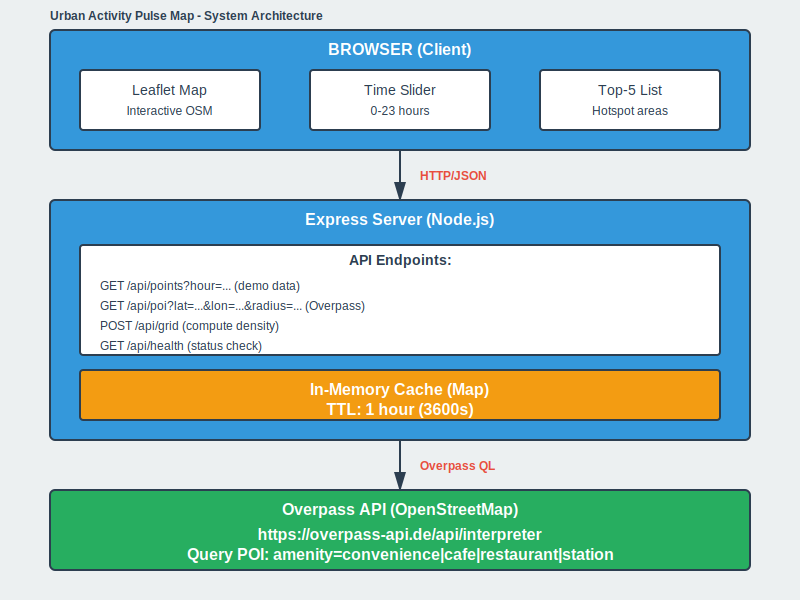

# Urban Activity Pulse Map - Final Project Web GIS Spatio-Temporal

slides about implementation can be find here:

https://spatiotemporaldata2025.github.io/TEUKU_zikri/daylast-slidev

---
## System Description

**Urban Activity Pulse Map** is a Web GIS application that displays spatio-temporal visualization of urban activity using:

- **Backend**: Node.js + Express
- **Frontend**: HTML/CSS/JavaScript + Leaflet + OpenStreetMap
- **Data**: Overpass API (OpenStreetMap) - 100% FREE
- **Platform**: Localhost (Ubuntu 24 WSL)

### Main Features

1. **Interactive Map** with Leaflet + OSM tiles
2. **Time Slider (0–23 hours)** - changes density visualization in real-time
3. **Activity Density Grid** - heatmap based on grid cells with color normalization
4. **Top-5 Hotspots** - list of areas with highest activity, click to zoom
5. **Dual Data Source**:
   - **Demo Data** (offline, deterministic) for quick testing
   - **Real POI** (Overpass API) for real data: convenience store, cafe, restaurant, station
6. **Click-to-fetch** - click map to set location and fetch POI within radius

---

## System Architecture



<details>
<summary>View Text Version</summary>

```
┌─────────────────────────────────────────────────────────────┐
│                    BROWSER (Client)                         │
│  ┌──────────────┐  ┌──────────────┐  ┌──────────────┐     │
│  │  Leaflet Map │  │ Time Slider  │  │  Top-5 List  │     │
│  └──────────────┘  └──────────────┘  └──────────────┘     │
└────────────────────────┬────────────────────────────────────┘
                         │ HTTP/JSON
┌────────────────────────▼────────────────────────────────────┐
│             Express Server (Node.js)                        │
│  ┌──────────────────────────────────────────────────┐      │
│  │ Endpoints:                                       │      │
│  │  GET  /api/points?hour=...  (demo data)         │      │
│  │  GET  /api/poi?lat=...&lon=...&radius=...       │      │
│  │  POST /api/grid (compute density)               │      │
│  │  GET  /api/health                                │      │
│  └──────────────────────────────────────────────────┘      │
│  ┌──────────────────────────────────────────────────┐      │
│  │ In-Memory Cache (Map) + TTL 1 hour              │      │
│  └──────────────────────────────────────────────────┘      │
└────────────────────────┬────────────────────────────────────┘
                         │ Overpass QL
┌────────────────────────▼────────────────────────────────────┐
│         Overpass API (OpenStreetMap)                        │
│  https://overpass-api.de/api/interpreter                    │
│  Query POI: amenity=convenience|cafe|restaurant|station     │
└─────────────────────────────────────────────────────────────┘
```
</details>

### Folder Structure

```
DayLast/
├── README.md                    # Main documentation (this file)
├── BLUEPRINT.md                 # 3-week blueprint (milestones)
├── OVERPASS_QUERIES.md          # Complete Overpass queries
├── DELIVERABLES_CHECKLIST.md   # Checklist for grading
├── illustrations/               # Screenshots, diagrams
│   ├── screenshot-demo.png
│   ├── screenshot-overpass.png
│   ├── architecture-diagram.png
│   └── demo-flow.gif
└── webgis_daylast/              # Source code
    ├── package.json
    ├── server.js                # Express server
    └── public/
        ├── index.html           # UI
        ├── main.js              # Frontend logic
        └── style.css            # Styling
```

---

## How to Run (Ubuntu 24 WSL)

### Prerequisites

1. **Node.js** version 18+ installed
2. **Internet connection** (to fetch Overpass API and OSM tiles)

### Step 1: Install Dependencies

```bash
cd ~/TEUKU_zikri/DayLast/webgis_daylast
npm install
```

Will install:
- `express` (web server)
- `axios` (HTTP client for Overpass API)

### Step 2: Start Server

```bash
npm start
```

Output:
```
Server running on http://localhost:8000
(WSL) Open from Windows browser: http://localhost:8000
```

### Step 3: Open in Browser

From **Windows browser** (Chrome/Firefox/Edge), open:

```
http://localhost:8000
```

### Step 4: Test Demo Data (Offline)

1. **Default mode**: "Demo Data" is active
2. **Slide hour slider** (0–23) → heatmap changes
3. **Zoom/pan map** → grid recalculates for viewport
4. **Click Top-5 item** → map zooms to hotspot
5. **Adjust cell size** → change grid resolution

### Step 5: Test Real POI (Overpass API)

1. **Select "Real POI (Overpass API)"**
2. **Set location**:
   - Manual input: enter lat/lon (e.g., Tokyo Station 35.681 / 139.767)
   - Click map: click map to auto-set location
3. **Select categories**: Convenience, Cafe, Restaurant, Station
4. **Set radius**: default 3000m (3km)
5. **Click "Fetch POI from Overpass"**
6. **Wait**: loading indicator will appear
7. **Result**: POI appears on map, hour slider is active

---

## Algoritma: Activity Density Grid

### Input
- Array of points: `[{lat, lon, hour, ...}]`
- Viewport bounds: `{latMin, latMax, lonMin, lonMax}`
- Cell size: `cellSize` (dalam derajat, default 0.01 ≈ 1km)
- Selected hour: `hour` (0–23)

### Algorithm

```javascript
function computeActivityGrid(points, bounds, cellSize, hour) {
  // 1. Filter points by hour
  let filtered = points.filter(p => p.hour === hour);
  
  // 2. Count points per grid cell
  let counts = {};
  for (let p of filtered) {
    if (!inBounds(p, bounds)) continue;
    
    // Grid index
    let i = floor((p.lat - bounds.latMin) / cellSize);
    let j = floor((p.lon - bounds.lonMin) / cellSize);
    let key = `${i},${j}`;
    
    counts[key] = (counts[key] || 0) + 1;
  }
  
  // 3. Build cell array with bounds & center
  let cells = [];
  for (let [key, count] of Object.entries(counts)) {
    let [i, j] = key.split(',').map(Number);
    let south = bounds.latMin + i * cellSize;
    let north = south + cellSize;
    let west = bounds.lonMin + j * cellSize;
    let east = west + cellSize;
    
    cells.push({
      key, count,
      bounds: {south, north, west, east},
      center: {lat: (south+north)/2, lon: (west+east)/2}
    });
  }
  
  // 4. Sort by count descending → Top-5
  cells.sort((a, b) => b.count - a.count);
  let top5 = cells.slice(0, 5);
  
  return { cells, top5, maxCount: cells[0]?.count || 0 };
}
```

### Complexity
- **Time**: O(n + k log k)
  - n = number of points (filter + count)
  - k = number of cells (sort)
- **Space**: O(k)
  - k cells in viewport

### Color Normalization (Heatmap)
```javascript
opacity = 0.10 + 0.70 * (count / maxCount)

if (count/maxCount > 0.7) color = "red"    // hot
else if (count/maxCount > 0.4) color = "orange"  // warm
else if (count/maxCount > 0.2) color = "yellow"  // medium
else color = "blue"  // cool
```

---

## Overpass API: Query POI

### Endpoint
```
POST https://overpass-api.de/api/interpreter
Content-Type: text/plain
```

### Query Format (Overpass QL)

```overpassql
[out:json][timeout:25];
(
  node["amenity"="convenience"](around:3000,35.681,139.767);
  node["amenity"="cafe"](around:3000,35.681,139.767);
  node["amenity"="restaurant"](around:3000,35.681,139.767);
  node["railway"="station"](around:3000,35.681,139.767);
  node["public_transport"="station"](around:3000,35.681,139.767);
);
out body;
```

### Parameters
- `around:RADIUS,LAT,LON` - radius in meters
- `node["key"="value"]` - filter by tag
- `out body` - return full node data (lat, lon, tags)

### Response (JSON)
```json
{
  "elements": [
    {
      "type": "node",
      "id": 123456,
      "lat": 35.681,
      "lon": 139.767,
      "tags": {
        "amenity": "cafe",
        "name": "Cafe Example",
        "opening_hours": "Mo-Fr 08:00-20:00"
      }
    },
    ...
  ]
}
```

### Caching Strategy
- **In-memory Map**: `cache.set(key, {data, timestamp})`
- **TTL**: 1 hour (3600000ms)
- **Cache key**: `"${lat},${lon},${radius},${categories}"`
- **Hit**: return cached data + `cached: true`
- **Miss**: fetch Overpass → cache → return

---

## Spatio-Temporal Aspects

### Spatio (Space)
- **Grid cells** with lat/lon bounds
- **Distance-based query**: radius from center point
- **Viewport filtering**: only render in-view data
- **Zoom-adaptive**: adjustable grid resolution

### Temporal (Time)
- **Hour slider (0–23)**: time-of-day simulation
- **Dynamic filtering**: filter points by selected hour
- **Activity patterns**:
  - Peak hours: 8–10 (morning), 17–20 (evening)
  - Off-peak: 0–6 (night), 22–23 (late night)
- **Real-time update**: grid re-renders when slider changes

### Synthetic Hour Distribution (for POI)
Since Overpass API doesn't return "real-time opening hours", we use **synthetic distribution**:

```javascript
// Weighted distribution
if (rand < 15%) hour = 8-10   // morning peak
else if (rand < 30%) hour = 17-20  // evening peak
else if (rand < 50%) hour = 11-16  // midday
else hour = random 0-23  // rest distributed
```

---

## Screenshots & Demo

See `illustrations/` folder:
- `screenshot-demo.png` - Demo data mode
- `screenshot-overpass.png` - Real POI mode
- `architecture-diagram.png` - System architecture
- `demo-flow.gif` - Animated demo (optional)

---

## Deliverables Checklist

**Source Code**
- `server.js` with Overpass integration + caching
- `index.html`, `main.js`, `style.css` with complete UI
- `package.json` with dependencies

**Documentation**
- README.md (this file) with comprehensive explanation
- 3-week blueprint (BLUEPRINT.md)
- Overpass queries (OVERPASS_QUERIES.md)
- Deliverables checklist (DELIVERABLES_CHECKLIST.md)

**Required Features**
- [x] Interactive map (Leaflet + OSM)
- [x] Time slider (0–23 hours)
- [x] Activity density grid (heatmap)
- [x] Top-5 hotspots (clickable)
- [x] Free data (Overpass API)
- [x] Spatio-temporal algorithm

**Bonus**
- [x] Dual data source (demo + real)
- [x] Click-to-set location
- [x] Category selection (multiple)
- [x] Caching (performance)
- [x] Error handling
- [x] Responsive UI

---

## Presentation (3-Minute Demo)

### Demo Script

**Minute 1: Intro + Demo Data**
```
"Good morning/afternoon. I'm [name], student ID [id].
This is Urban Activity Pulse Map, a Web GIS application for
spatio-temporal visualization of urban activity.

[Show browser] Here's the map with density grid.
[Slide time slider] When I slide the time slider,
the grid changes according to activity distribution per hour.

[Zoom/pan] Grid is calculated in real-time for the viewport.
[Click Top-5] These are the top-5 hotspots, click to zoom to area."
```

**Minute 2: Overpass API**
```
"Now Real POI mode. [Toggle radio]
I'll select a location [click map or manual input],
set radius to 3km, select Cafe and Convenience categories.

[Click Fetch POI] System fetches from Overpass API...
[Wait] Loading... [Result appears]
Done! Now there are [X] POI from OpenStreetMap.

This data is 100% free, no billing, directly from
OpenStreetMap via Overpass API."
```

**Minute 3: Algorithm + Q&A**
```
"Density grid algorithm:
1. Filter points by hour
2. Count per grid cell (binning)
3. Color normalization (heatmap)
4. Sort for Top-5

Complexity O(n + k log k).

Backend: Node.js + Express with 1-hour caching.
Frontend: Leaflet for maps, Vanilla JS.

All source code is in the repo. Thank you!"
```

---

## Troubleshooting

### Error: `Cannot find module 'axios'`
```bash
npm install
```

### Error: Overpass API timeout
- **Cause**: Query too complex or radius too large
- **Fix**: Reduce radius (<5000m) or select fewer categories

### Error: CORS (if opening file:///)
- **Cause**: Opening HTML directly, not via server
- **Fix**: Must use `npm start` and open `http://localhost:8000`

### Map not appearing
- **Check**: Console error? Leaflet CDN loaded?
- **Fix**: Ensure internet is active to load Leaflet + OSM tiles

### Cache not clearing
- **Restart server**: Cache is in-memory, cleared on restart

---

## References

- **Leaflet**: https://leafletjs.com/
- **OpenStreetMap**: https://www.openstreetmap.org/
- **Overpass API**: https://overpass-api.de/
- **Overpass QL Docs**: https://wiki.openstreetmap.org/wiki/Overpass_API
- **Express.js**: https://expressjs.com/

---

## Development Notes

**What has been achieved:**
- Full Overpass integration with caching
- Dual data source (demo + real)
- Activity density algorithm with color normalization
- Interactive Top-5 hotspots
- Click-to-set location
- Comprehensive documentation

**Potential improvements (future work):**
- [ ] Real opening_hours parsing (if tag available)
- [ ] Save/load favorite locations
- [ ] Export data to GeoJSON/CSV
- [ ] Heatmap.js plugin for alternative visualization
- [ ] Animation slider (auto-play 0→23)

