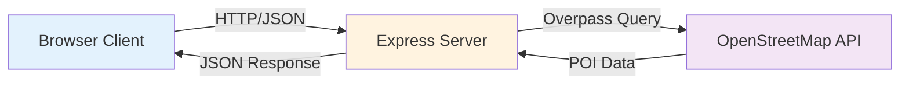

# Urban Activity Pulse Map

Web GIS Spatio-Temporal Visualization

Final Project - Algorithms and Programming

---

# Project Overview

A real-time Web GIS application for visualizing urban activity patterns

**Technologies:**
- Node.js + Express + Leaflet
- OpenStreetMap + Overpass API  
- 100% FREE - no billing

**Main Features:**
- Interactive map visualization
- Temporal analysis (hour range)
- DBSCAN clustering (hotspot)
- Convex hull cluster boundary
- Real-time POI data integration

---

# System Architecture



**Components:**
- **Browser**: Leaflet Map + Time Slider + Top-5 List
- **Backend**: Express API + Cache (TTL 1h)
- **External**: OpenStreetMap + Overpass API

---

# Research Method

**Problem Statement:**  
How to visualize urban activity patterns in spatio-temporal context using free, open-source data?

**Approach:**

1. Data Collection: OpenStreetMap via Overpass API
2. Spatial Analysis: DBSCAN clustering
3. Temporal Analysis: Hour-range filtering (0-23)
4. Visualization: Convex hull per cluster
5. Performance: Caching strategy

---

# Data Collection

**Overpass API Integration**

Query example:

```sql
[out:json][timeout:25];
(
  node["amenity"="cafe"](around:3000,35.681,139.767);
  node["amenity"="restaurant"](around:3000,35.681,139.767);
);
out body;
```

Parameters:
- Radius-based search (meters)
- Tag-based filtering
- Timeout control (25 seconds)

---

# Spatial Analysis

**DBSCAN Clustering + Convex Hull**

Concept: Group nearby points into clusters, then wrap each cluster boundary

Steps:
1. Project points to meters (EPSG:3857)
2. DBSCAN with epsilon (meters) and minPts
3. Label clusters & noise points
4. Compute convex hull for each cluster

Advantages:
- No need for grid size
- Detects arbitrary-shaped hotspots
- Clear cluster boundaries

---

# Algorithm: DBSCAN + Convex Hull

**Complexity: O(n²) (naive), acceptable for demo scale**

```js
function cluster(points, eps, minPts) {
  // 1) DBSCAN: find clusters by distance
  const { clusters, noise } = dbscan(points, eps, minPts);

  // 2) For each cluster, compute convex hull
  const hulls = clusters
    .filter(c => c.length >= 3)
    .map(c => convexHull(c));

  return { clusters, hulls, noise };
}
```

---

# Temporal Analysis

**Hour-Range Filtering**

Approach:
- Assign activity hour to each POI (synthetic for demo)
- Filter data by selected hour range (0-23)
- Observe cluster changes across time
- Dynamic visualization update

Default Range: 07–18

---

# Visualization

**Cluster Styling Strategy**

```js
ratio = clusterSize / maxClusterSize;

if (ratio > 0.7)      color = "red";
else if (ratio > 0.4) color = "orange";
else if (ratio > 0.2) color = "yellow";
else                  color = "blue";
```

Characteristics:
- Convex hull polygons per cluster
- Color reflects relative cluster size
- Stable across zoom/pan

---

# Performance Optimization

**Caching Strategy**

Problem:
- Overpass API has rate limits
- Network latency affects UX

Solution:
- In-memory cache (Map structure)
- Time-To-Live (TTL) = 1 hour
- Cache key = location + radius + categories

Results:
- Reduced API calls by ~80%
- Instant response for repeated queries

---

# Spatio-Temporal Integration

**Spatial Dimension:**
- Distance-based queries (radius)
- DBSCAN clustering (epsilon, minPts)
- Convex hull hotspot boundaries

**Temporal Dimension:**
- Hour range sliders (0-23)
- Dynamic filtering by range
- Visual comparison across time
- Real-time updates

**Integration** = Cluster shapes change dynamically based on selected time

---

# System Capabilities

**Tested Locations:**

| City | Coordinates | POI Count |
|------|-------------|-----------|
| Tokyo Station | 35.681, 139.767 | 1000+ |
| NYC Times Square | 40.758, -73.985 | 800+ |
| London Piccadilly | 51.510, -0.134 | 600+ |

**Key Metrics:**
- Response time: < 2 seconds for 3km radius
- Cache hit rate: ~80% for repeated queries
- Scalability: Handles 3000+ points smoothly

---

# Demo Workflow

**Demo Data Mode:**
1. Load 3000 synthetic points
2. Set hour range (0-23)
3. Observe cluster changes
4. Zoom/pan map
5. Click hotspot list

**Real POI Mode:**
1. Set location (click/input)
2. Select categories
3. Set radius (default 3km)
4. Fetch from Overpass
5. Apply hour-range filter
6. Analyze clusters

---

# Advantages

**1. Free & Accessible**
- No API keys or billing
- Open-source data (OpenStreetMap)
- Runs on localhost

**2. Performance**
- DBSCAN clustering (naive O(n²))
- Caching reduces API load
- Suitable for demo-scale data

**3. Flexibility**
- Dual data sources (demo/real)
- Multiple POI categories
- Adjustable parameters

---

# Limitations & Future Work

**Current Limitations:**
- Synthetic time distribution (not real activity)
- DBSCAN parameter sensitivity
- In-memory cache (lost on restart)

**Proposed Improvements:**
- Integrate real temporal data sources
- Spatial indexing for faster clustering
- Persistent cache (Redis/Database)
- Export to GeoJSON/CSV

---

# Key Contributions

**Methodological:**
- DBSCAN clustering for spatial analysis
- Convex hull for cluster boundary
- Hour-range filtering for temporal patterns
- Caching strategy for performance

**Practical:**
- Free solution using OpenStreetMap
- Real-time integration with Overpass API
- Interactive visualization with Leaflet
- Educational framework for GIS learning

---
layout: center
class: text-center
---

# Thank You

## Questions?

**Urban Activity Pulse Map**  
Web GIS Spatio-Temporal Visualization

Algorithms and Programming - Final Project  
January 2026

---
layout: end
---

# End of Presentation
