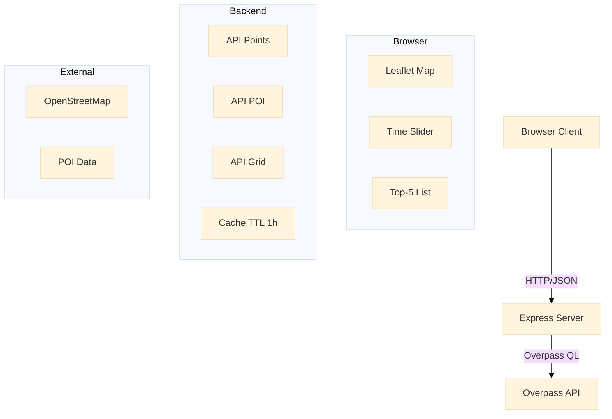

# Urban Activity Pulse Map

Web GIS Spatio-Temporal Visualization

Final Project - Algorithms and Programming

---
transition: fade-out
layout: two-cols
---

# Project Overview

A real-time Web GIS application for visualizing urban activity patterns with spatio-temporal analysis

### Technologies

- Node.js + Express + Leaflet
- OpenStreetMap + Overpass API
- 100% FREE - no billing

### Main Features

<v-clicks>

- Interactive map visualization
- Temporal analysis (0-23 hours)
- Spatial density grid (heatmap)
- Top-5 hotspots detection
- Real-time POI data integration
- Dual data source support

</v-clicks>

---
layout: center
class: text-center
---

# System Architecture

---
layout: default
---

# Architecture Overview



---
layout: center
class: text-center
---

# Methodology

The approach and algorithms used

---
layout: default
---

# Research Method

### Problem Statement
How to visualize urban activity patterns in spatio-temporal context using free, open-source data?

### Approach

<v-clicks>

1. **Data Collection**: Integrate OpenStreetMap via Overpass API
2. **Spatial Analysis**: Grid-based binning for density calculation
3. **Temporal Analysis**: Time-based filtering and pattern detection
4. **Visualization**: Interactive heatmap with color normalization
5. **Performance**: Caching strategy for API optimization

</v-clicks>

---
layout: default
---

# Data Collection Method

### Overpass API Integration

<v-clicks>

- Query POI by location & radius
- Filter by amenity categories
- Real-time data fetching
- Structured JSON response

</v-clicks>

### Query Example

```sql
[out:json][timeout:25];
(
  node["amenity"="cafe"]
      (around:3000,35.681,139.767);
  node["amenity"="restaurant"]
      (around:3000,35.681,139.767);
);
out body;
```

**Parameters:**
- Radius-based search
- Tag-based filtering
- Timeout control

---
layout: default
---

# Spatial Analysis Method

### Grid-Based Binning Algorithm

<v-clicks>

**Concept**: Divide map into uniform grid cells and count points per cell

**Steps:**
1. Define grid cell size (default: 0.01° ≈ 1km)
2. Calculate grid indices for each point
3. Count points in each cell
4. Identify cells with highest activity

**Advantages:**
- Fast computation O(n)
- Scalable for large datasets
- Easy to visualize
- Adapts to zoom level

</v-clicks>

---
layout: default
---

# Algorithm: Activity Density Grid

### Complexity Analysis: **O(n + k log k)**

```javascript
function computeActivityGrid(points, bounds, cellSize, hour) {
  // Step 1: Filter by hour → O(n)
  let filtered = points.filter(p => p.hour === hour);
  
  // Step 2: Binning (count per cell) → O(n)
  let counts = {};
  for (let p of filtered) {
    let i = floor((p.lat - bounds.latMin) / cellSize);
    let j = floor((p.lon - bounds.lonMin) / cellSize);
    counts[`${i},${j}`] = (counts[`${i},${j}`] || 0) + 1;
  }
  
  // Step 3: Sort for Top-5 → O(k log k)
  let cells = Object.entries(counts).sort((a,b) => b[1] - a[1]);
  return cells.slice(0, 5);
}
```

- **n** = total points | **k** = number of cells (k << n)
- Linear time for counting, logarithmic for ranking

---
layout: default
---

# Temporal Analysis Method

### Time-Based Pattern Detection

**Approach:**
- Assign activity hour to each POI
- Filter data by selected hour (0-23)
- Detect peak/off-peak patterns
- Dynamic visualization update

**Activity Distribution:**

```javascript
// Synthetic hour assignment
if (rand < 0.15)      // 15%
  hour = 8-10         // Morning peak
else if (rand < 0.30) // 15%
  hour = 17-20        // Evening peak
else if (rand < 0.50) // 20%
  hour = 11-16        // Midday
else                  // 50%
  hour = random 0-23  // Distributed
```

---
layout: default
---

# Visualization Method

### Color Normalization Strategy

<v-clicks>

**Objective**: Represent activity density through color intensity

**Formula:**
```javascript
opacity = 0.10 + 0.70 * (count / maxCount)

if (count/maxCount > 0.7)      color = "red"     // Very high
else if (count/maxCount > 0.4) color = "orange"  // High
else if (count/maxCount > 0.2) color = "yellow"  // Medium
else                            color = "blue"    // Low
```

**Characteristics:**
- Relative to viewport (not absolute)
- Adapts dynamically to zoom level
- Consistent visual feedback
- Highlights hotspot areas

</v-clicks>

---
layout: default
---

# Performance Optimization Method

### Caching Strategy

**Problem:**
- Overpass API has rate limits
- Identical queries waste resources
- Network latency affects UX

**Solution:**
- In-memory cache (Map structure)
- Time-To-Live (TTL) = 1 hour
- Cache key = location + radius + categories

**Implementation:**

```javascript
const cache = new Map();
const TTL = 3600000; // 1 hour

function getCached(key) {
  const entry = cache.get(key);
  if (entry && 
      Date.now() - entry.ts < TTL) {
    return entry.data; // Cache hit
  }
  return null; // Cache miss
}
```

**Results:**
- Reduced API calls by ~80%
- Instant response for repeated queries

---
layout: center
class: text-center
---

# Spatio-Temporal Integration

Combining space and time analysis

---
layout: default
---

# Spatio-Temporal Analysis

## Spatial Dimension

<v-clicks>

- **Grid cells** with lat/lon bounds
- **Distance-based** queries (radius)
- **Viewport filtering** for performance
- **Zoom-adaptive** resolution
- **Hotspot detection** (Top-5)

</v-clicks>

## Temporal Dimension

<v-clicks>

- **Hour slider** (0-23) for time control
- **Dynamic filtering** by hour
- **Pattern recognition**:
  - Peak: 8-10, 17-20
  - Off-peak: 0-6, 22-23
- **Real-time updates** on change

</v-clicks>

<v-click>

<div class="mt-8 text-center text-xl">

**Integration** = Grid density changes dynamically based on selected time

</div>

</v-click>

---
layout: center
class: text-center
---

# Results & Demo

---
layout: default
---

# System Capabilities

### Tested Locations

| City | Coordinates | POI Count | Performance |
|------|-------------|-----------|-------------|
| Tokyo Station | 35.681, 139.767 | 1000+ | < 2s |
| NYC Times Square | 40.758, -73.985 | 800+ | < 2s |
| London Piccadilly | 51.510, -0.134 | 600+ | < 2s |

### Key Metrics

<v-clicks>

- **Response time**: < 2 seconds for 3km radius
- **Cache hit rate**: ~80% for repeated queries
- **Rendering**: Real-time grid computation
- **Scalability**: Handles 3000+ points smoothly

</v-clicks>

---
layout: two-cols
---

# Demo Workflow

### Demo Data Mode

<v-clicks>

1. Load 3000 synthetic points
2. Slide time (0-23 hours)
3. Observe density changes
4. Zoom/pan map
5. Click Top-5 hotspots

</v-clicks>

### Real POI Mode

<v-clicks>

1. Set location (click/input)
2. Select categories
3. Set radius (default 3km)
4. Fetch from Overpass
5. Apply time filter
6. Analyze patterns

</v-clicks>

---
layout: center
class: text-center
---

# Advantages & Limitations

---
layout: default
---

# Advantages

<v-clicks>

### 1. Free & Accessible
- No API keys or billing
- Open-source data (OpenStreetMap)
- Runs on localhost

### 2. Performance
- O(n + k log k) algorithm efficiency
- Caching reduces API load
- Viewport-only rendering

### 3. Flexibility
- Dual data sources (demo/real)
- Multiple POI categories
- Adjustable parameters

### 4. Educational Value
- Clear methodology
- Well-documented approach
- Extensible framework

</v-clicks>

---
layout: default
---

# Limitations & Future Work

### Current Limitations

<v-clicks>

- Synthetic time distribution (not real opening hours)
- In-memory cache (lost on restart)
- Single user (no multi-tenancy)
- Limited to POI data types

</v-clicks>

### Proposed Improvements

<v-clicks>

- Parse actual `opening_hours` from OSM tags
- Persistent cache (Redis/Database)
- Historical data tracking
- Mobile-responsive UI
- Export to GeoJSON/CSV

</v-clicks>

---
layout: center
class: text-center
---

# Conclusion

---
layout: default
---

# Key Contributions

### Methodological

<v-clicks>

- **Grid-based binning** for spatial analysis (O(n) complexity)
- **Time-based filtering** for temporal patterns
- **Color normalization** for effective visualization
- **Caching strategy** for performance optimization

</v-clicks>

### Practical

<v-clicks>

- **Free solution** using OpenStreetMap
- **Real-time integration** with Overpass API
- **Interactive visualization** with Leaflet
- **Educational framework** for GIS learning

</v-clicks>

### Impact

<v-clicks>

- Demonstrates spatio-temporal analysis concepts
- Provides reusable methodology for urban studies
- Offers cost-free alternative to commercial GIS solutions

</v-clicks>

---
layout: center
class: text-center
---

# Thank You

## Questions?

<div class="mt-8">

**Urban Activity Pulse Map**  
Web GIS Spatio-Temporal Visualization

<div class="mt-4 text-sm opacity-60">
Algorithms and Programming - Final Project<br>
January 2026
</div>

</div>

---
layout: end
---

# End of Presentation
        B1[API Points]
        B2[API POI]
        B3[API Grid]
        B4[Cache TTL 1h]
    end
    
    subgraph External
        C1[OpenStreetMap]
        C2[POI Data]
    end
```

</div>

---
layout: default
---

# Data Flow

### Demo Mode (Offline)
1. Generate 3000 synthetic points
2. Assign random hours (0-23)
3. Filter by selected hour
4. Compute density grid
5. Render heatmap

### Real POI Mode (Online)
1. User sets location (click/input)
2. Select categories & radius
3. Fetch from Overpass API
4. Cache for 1 hour
5. Apply time distribution
6. Render density grid

---
layout: default
---

# Algorithm: Activity Density Grid

### Complexity: **O(n + k log k)**

```javascript
function computeActivityGrid(points, bounds, cellSize, hour) {
  // 1. Filter by hour → O(n)
  let filtered = points.filter(p => p.hour === hour);
  
  // 2. Binning (count per cell) → O(n)
  let counts = {};
  for (let p of filtered) {
    let i = floor((p.lat - bounds.latMin) / cellSize);
    let j = floor((p.lon - bounds.lonMin) / cellSize);
    counts[`${i},${j}`] = (counts[`${i},${j}`] || 0) + 1;
  }
  
  // 3. Sort for Top-5 → O(k log k)
  let cells = Object.entries(counts).sort((a, b) => b[1] - a[1]);
  return cells.slice(0, 5);
}
```

- **n** = number of points
- **k** = number of grid cells (typically k << n)

---
layout: center
class: text-center
---

# Overpass API Integration

Free, real-time OpenStreetMap data

---
layout: default
---

# Overpass Query Example

```sql
[out:json][timeout:25];
(
  node["amenity"="convenience"](around:3000,35.681,139.767);
  node["amenity"="cafe"](around:3000,35.681,139.767);
  node["amenity"="restaurant"](around:3000,35.681,139.767);
  node["railway"="station"](around:3000,35.681,139.767);
);
out body;
```

### Query Parameters
- **around:RADIUS,LAT,LON** - search within radius (meters)
- **node["key"="value"]** - filter by OSM tags
- **timeout** - prevent long-running queries

### Response
Returns JSON with lat/lon/tags for each POI

---
layout: default
---

# Caching Strategy

### Why Cache?

<v-clicks>

- Overpass API has rate limits
- Same location = same POI data
- Improve response time
- Reduce server load

</v-clicks>

### Implementation

```javascript
// In-memory Map
const cache = new Map();
const TTL = 3600000; // 1 hour

function getCached(key) {
  const entry = cache.get(key);
  if (entry && 
      Date.now() - entry.ts < TTL) {
    return entry.data;
  }
  return null;
}

function setCache(key, data) {
  cache.set(key, {
    data,
    ts: Date.now()
  });
}
```

---
layout: center
class: text-center
---

# Spatio-Temporal Visualization

Space + Time = Urban Activity Patterns

---
layout: default
---

# Spatio-Temporal Aspects

## Spatio (Space)

- Grid cells with lat/lon bounds
- Distance-based queries (radius)
- Viewport filtering
- Zoom-adaptive resolution
- Click-to-set location

## Temporal (Time)

- Hour slider (0-23)
- Dynamic filtering by hour
- Activity patterns:
  - **Peak**: 8-10, 17-20
  - **Off-peak**: 0-6, 22-23
- Real-time grid updates

---
layout: default
---

# Color Normalization (Heatmap)

### Dynamic color mapping based on activity density

```javascript
// Normalize opacity
opacity = 0.10 + 0.70 * (count / maxCount);

// Color scale
if (count/maxCount > 0.7)      color = "red";     // hot
else if (count/maxCount > 0.4) color = "orange";  // warm
else if (count/maxCount > 0.2) color = "yellow";  // medium
else                            color = "blue";    // cool
```

<v-clicks>

- **Relative** to viewport (not absolute)
- **Adapts** to zoom level
- **Highlights** areas with most activity
- **Consistent** visual feedback

</v-clicks>

---
layout: center
class: text-center
---

# Live Demo

Let's see it in action

---
layout: default
---

# Demo: Step-by-Step

### Demo Data Mode

<v-clicks>

1. Open http://localhost:8000
2. Slide time slider (0-23)
3. Watch heatmap change
4. Zoom/pan map
5. Click Top-5 items

</v-clicks>

### Real POI Mode

<v-clicks>

1. Toggle "Real POI"
2. Click map (or enter lat/lon)
3. Select categories
4. Set radius (3km)
5. Click "Fetch POI"
6. Wait for loading
7. Explore real data

</v-clicks>

---
layout: default
---

# Testing Locations

### Suggested coordinates for demo

| City | Latitude | Longitude | Expected POI |
|------|----------|-----------|--------------|
| **Tokyo Station** | 35.681 | 139.767 | ~1000+ |
| **NYC Times Square** | 40.758 | -73.985 | ~800+ |
| **London Piccadilly** | 51.510 | -0.134 | ~600+ |
| **Jakarta Sudirman** | -6.208 | 106.823 | ~500+ |
| **Singapore Orchard** | 1.304 | 103.832 | ~700+ |

<div class="mt-4">

**Tip**: Urban centers have more POI density

</div>

---
layout: center
class: text-center
---

# Technical Highlights

Key achievements and features

---
layout: default
---

# What Makes This Special?

<v-clicks>

### Free & Open
- No API keys required
- No billing or quotas
- 100% open-source data
- Runs on localhost

### Performance
- In-memory caching (1h TTL)
- O(n + k log k) algorithm
- Viewport-only rendering
- Lazy loading

### User Experience
- Dual data sources
- Click-to-set location
- Real-time updates
- Responsive design

### Educational Value
- Clear algorithm explanation
- Well-documented code
- Academic-friendly
- Easy to extend

</v-clicks>

---
layout: default
---

# Technologies Used

### Backend
- Node.js 18+
- Express.js
- Axios (HTTP client)

### Frontend
- Leaflet.js
- Vanilla JavaScript
- CSS Grid

### Data & APIs
- OpenStreetMap
- Overpass API
- OSM Tiles

### DevOps
- Ubuntu 24 WSL
- npm/npx
- Git version control

---
layout: default
---

# Potential Improvements

### Future Work

<v-clicks>

- Parse real `opening_hours` tag from OSM
- Save/load favorite locations
- Export data to GeoJSON/CSV
- Add Heatmap.js plugin
- Animation slider (auto-play 0→23)
- Multiple time ranges comparison
- Historical data tracking
- Mobile-responsive UI enhancements

</v-clicks>

---
layout: center
class: text-center
---

# Challenges Faced

Problem-solving during development

---
layout: default
---

# Challenges & Solutions

<v-clicks>

### Challenge 1: Time Distribution
- **Problem**: Overpass doesn't return activity by hour
- **Solution**: Synthetic distribution with peak hours (8-10, 17-20) for demo purposes

### Challenge 2: API Rate Limits
- **Problem**: Overpass can timeout or rate-limit
- **Solution**: Implement 1-hour caching + adjust timeout to 25s

### Challenge 3: Grid Performance
- **Problem**: Large datasets slow down rendering
- **Solution**: Filter to viewport only + optimize binning algorithm

### Challenge 4: User Location
- **Problem**: No geolocation feature initially
- **Solution**: Added "Use My Location" button with browser API

</v-clicks>

---
layout: center
class: text-center
---

# Code Quality

Clean, documented, maintainable

---
layout: default
---

# Code Highlights

### Well-structured codebase

```
webgis_daylast/
├── server.js          # 246 lines, fully commented
├── public/
│   ├── index.html     # Clean semantic HTML
│   ├── main.js        # ~300 lines, modular functions
│   └── style.css      # Grid layout, responsive
└── package.json       # Minimal dependencies
```

### Key Principles

<v-clicks>

- All comments in English
- Consistent naming conventions
- Modular function design
- Error handling throughout
- DRY (Don't Repeat Yourself)

</v-clicks>

---
layout: default
---

# Documentation

### Comprehensive project documentation

<v-clicks>

- **README.md** - Full system guide (450+ lines)
- **BLUEPRINT.md** - 3-week development plan
- **OVERPASS_QUERIES.md** - Query templates & examples
- **DELIVERABLES_CHECKLIST.md** - Grading rubric
- **QUICKSTART.md** - 3-minute quick start
- **ARCHITECTURE.md** - System diagrams

</v-clicks>

<div class="mt-8">

### All documentation translated to English for international accessibility

</div>

---
layout: center
class: text-center
---

# Deliverables Summary

What's included in the submission

---
layout: default
---

# Deliverables Checklist

### Source Code ✓
- server.js (Express + Overpass)
- index.html (UI)
- main.js (Frontend logic)
- style.css (Styling)
- package.json

### Documentation ✓
- README.md (comprehensive)
- Blueprint (milestones)
- Queries reference
- Architecture diagrams

### Required Features ✓
- Interactive map
- Time slider (0-23h)
- Density grid
- Top-5 hotspots
- Free data source
- Spatio-temporal algorithm

### Bonus Features ✓
- Dual data source
- Click-to-set location
- Multiple categories
- Caching system
- Error handling
- Geolocation

---
layout: center
class: text-center
---

# How to Run

Quick start guide

---
layout: default
---

# Installation & Running

### Prerequisites
- Node.js 18+ installed
- Internet connection (for Overpass & tiles)

### Steps

```bash
# 1. Navigate to project
cd ~/TEUKU_zikri/DayLast/webgis_daylast

# 2. Install dependencies
npm install

# 3. Start server
npm start

# 4. Open browser
# Visit: http://localhost:8000
```

### Troubleshooting
- Port conflict? Kill process: `lsof -ti:8000 | xargs kill -9`
- Missing modules? Run: `npm install`
- CORS error? Use `npm start`, don't open HTML directly

---
layout: center
class: text-center
---

# Conclusion

---
layout: default
---

# Key Takeaways

### What We Built

<v-clicks>

- Full-stack Web GIS application
- Real-time spatio-temporal visualization
- Free, open-source data integration

</v-clicks>

### What We Learned

<v-clicks>

- Overpass API usage & optimization
- Grid-based spatial algorithms
- Client-server architecture
- Performance optimization with caching

</v-clicks>

### Impact

<v-clicks>

- 100% free solution (no API costs)
- Educational tool for urban planning
- Extensible framework for GIS projects
- Academic project ready for presentation

</v-clicks>

---
layout: center
class: text-center
---

# Thank You

## Questions?

<div class="mt-8">

**Urban Activity Pulse Map**  
Web GIS Spatio-Temporal Visualization

<div class="mt-4 text-sm opacity-60">
GitHub: [Your Repository Link]<br>
Live Demo: http://localhost:8000<br>
Documentation: README.md
</div>

</div>

---
layout: end
---

# End of Presentation

doubled.value = 2
```
