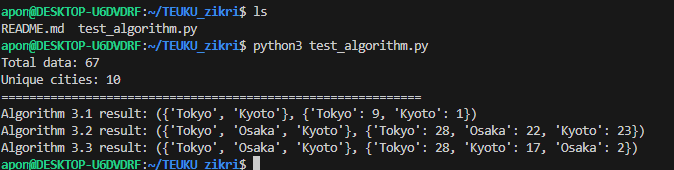

# Algorithm 3.1 3.2 3.3 implementation

**date:** 10 october 2025

## overview

we implemented and compared three algorithms (3.1, 3.2, and 3.3) as part of our class assignment.
each algorithm focuses on identifying and maintaining the most frequently appearing elements in a dataset.

## Algorithm 3.1 basic counting

This algorithm uses a simple counting approach.

we keep track of frequently appearing elements.
when the memory (set t) is full, we decrease the counter of all elements and remove those that reach zero.
this approach keeps only elements that appear often but it may fluctuate when new data appears rapidly.

## Algorithm 3.2 delta-based normalization

This algorithm use a time threshold delta to normalize data over time.

every time the sequence progresses, the algorithm updates delta and removes elements whose count is lower than delta.
this makes the algorithm more stable and adaptive as time goes on.

## Algorithm 3.3 replace the least frequent

The main idea is to replace the element that appears the least frequently.

when our list is full and a new element appears, we find the one with the smallest counter and replace it.
this is a more precise version of the least frequently used (lfu) algorithm.

## Implementation and result

the test implementation of these algorithms was written in python and located in the file `test_algorithm.py`.
the execution result can be seen below.

